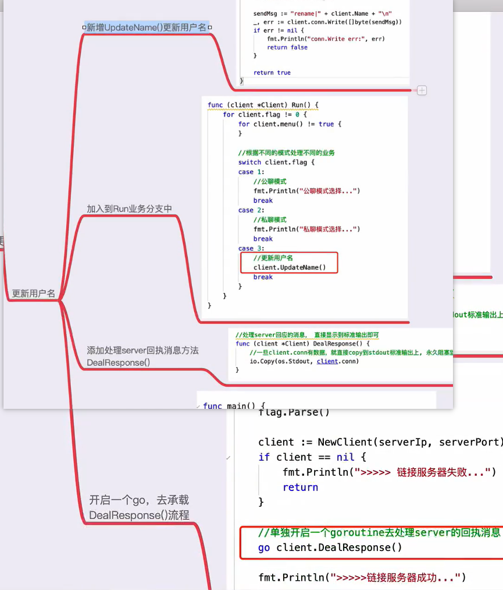

## v9.4 客户端实现-更新用户名
```go
//编译运行
go build -o server server.go main.go
./server

go build client.go
./client -ip 192.168.56.105 -port 8888
```
```go
//测试连接
nc 127.0.0.1 8888//ubuntu
telnet 192.168.56.105 8888//windows
```
